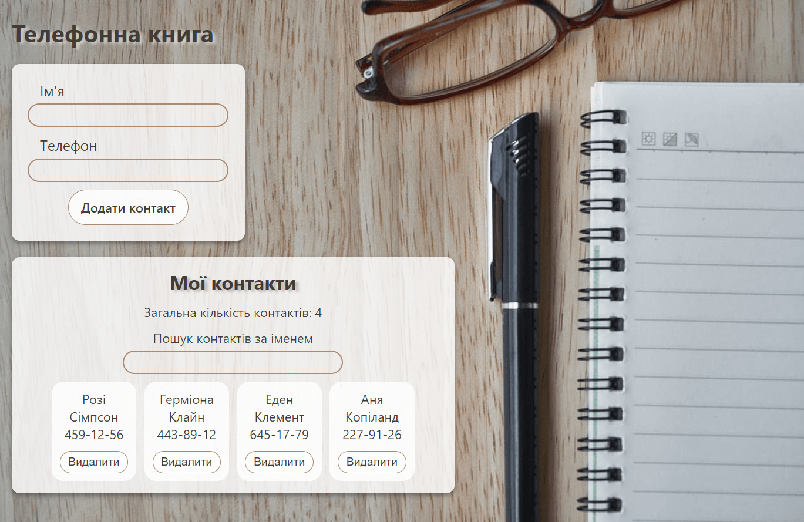
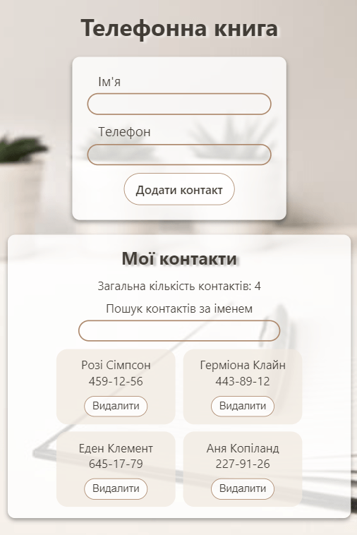

# Книга контактів
Виконано рефакторинг коду застосунку «Книга контактів», додавши управління станом за допомогою бібліотеки Redux Toolkit.

Використано бібліотеку Redux Persist для збереження масиву контактів у локальному сховищі

P.S. Дані бібліотеки використовувались в цілях вивчення та засвоєння цих бібліотек. Розуміння того, що на даному проєкті не потрібно використовувати ці бібліотеки є =)

